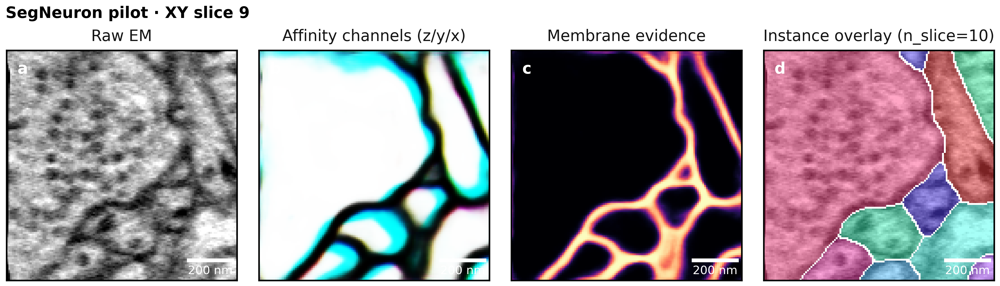
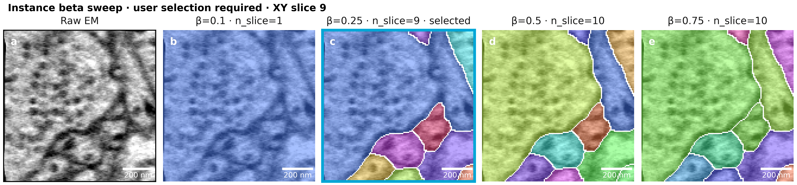
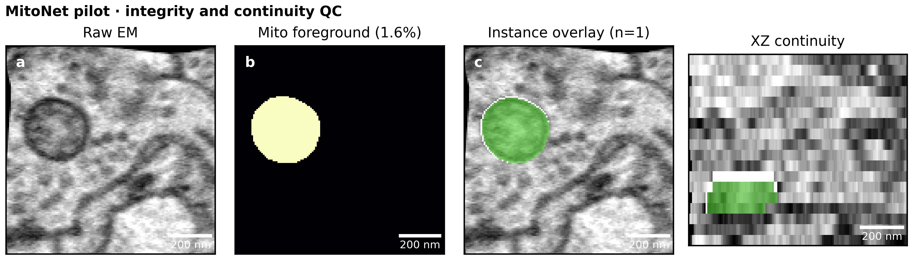
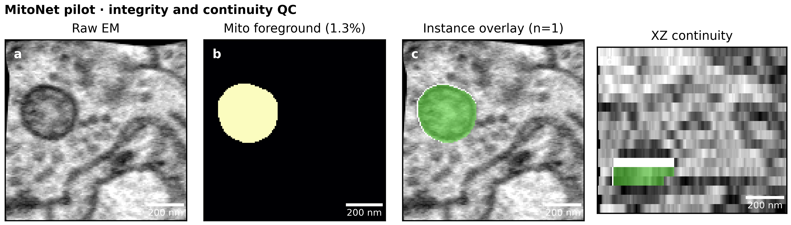
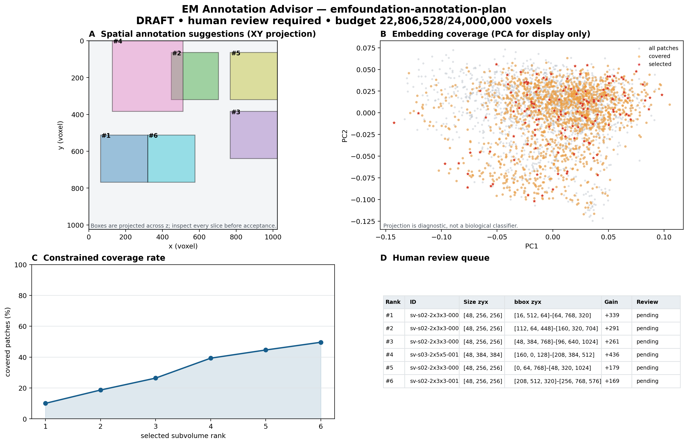
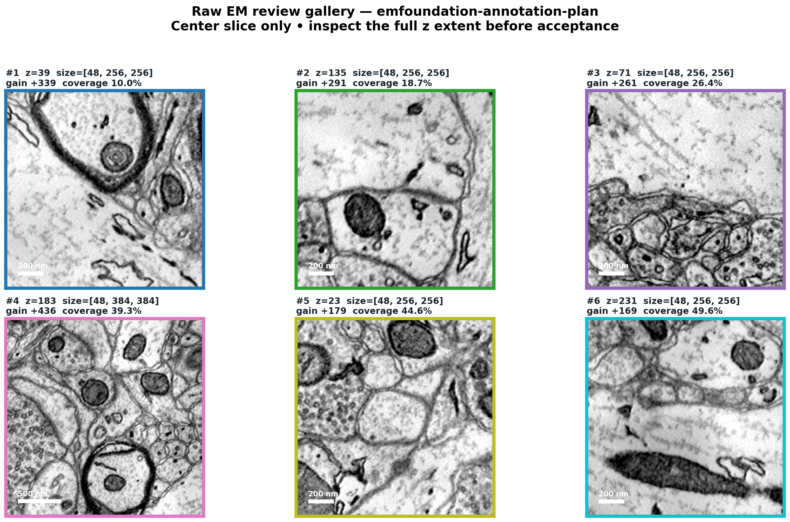
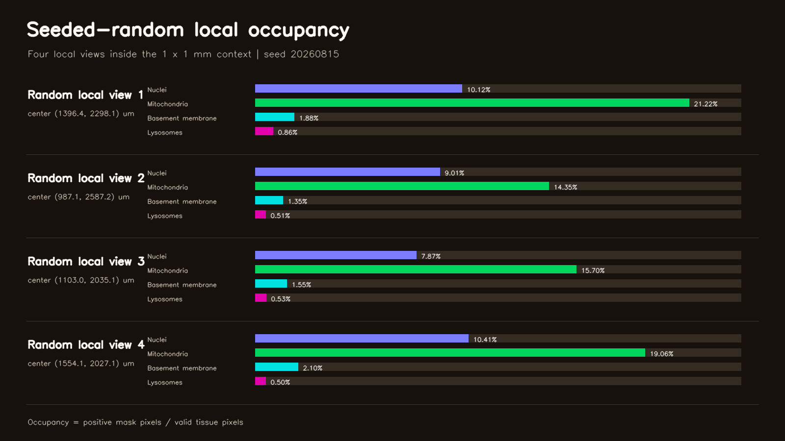

# EM-Skills

**Reusable Agent Skills for Electron Microscopy Analysis**

English | [简体中文](README.zh-CN.md)

EM-Skills packages specialized EM methods as task-routed Agent Skills. Each Skill combines domain guidance, deterministic scripts, model/configuration references, and scientific quality gates.

Use one Skill for a focused task—such as auditing metadata, comparing beta values, or visualizing existing labels—or compose several Skills for dataset adaptation. The Agent should reuse existing artifacts and run only the stages needed for the requested outcome.

## Skills at a glance

| Skill | Use it for | Main outputs |
| --- | --- | --- |
| [`segneuron-inference`](skills/segneuron-inference/SKILL.md) | SegNeuron affinity inference and 3D neuron reconstruction | affinities, multi-beta instances, source-grid labels, QC figures |
| [`mitonet-inference`](skills/mitonet-inference/SKILL.md) | MitoNet mitochondrial segmentation | semantic masks, 3D instances, profile comparisons, QC figures |
| [`suggest-em-annotations`](skills/suggest-em-annotations/SKILL.md) | Embedding-guided, variable-size subvolume selection | annotation queue, UMAP/spatial review, approved manifest |
| [`bootstrap-em-segmentation`](skills/bootstrap-em-segmentation/SKILL.md) | Cross-Skill adaptation on a new EM dataset | coarse reconstruction, selective corrections, training handoff, paired evaluation |
| [`cloudvolume-video`](skills/cloudvolume-video/SKILL.md) | Neuroglancer preparation, local-field overlays, density views, smooth camera tours, and 3D mesh presentation | verified precomputed sources, viewer handoff, MP4, PLY mesh |

Supported inputs include TIFF, NumPy, Zarr, N5, CloudVolume/precomputed, and other serial-section or volume EM datasets, including FIB-SEM, SBF-SEM, ATUM-SEM, and ssTEM.

## How the Skills work together

Single-stage requests go directly to the relevant Skill. Requests that span reconstruction, selective correction, and adaptation use `$bootstrap-em-segmentation` as the coordinator.

```text
Unseen 3D EM (xy: 5–10 nm)
  → $segneuron-inference: zero-shot coarse reconstruction
  → $suggest-em-annotations: variable-size region selection
  → Human expert: connectivity correction
  → SegNeuron fine-tuning or lightweight-model training
  → $segneuron-inference: paired holdout evaluation
  ↺ Iterate with new selections from training regions only
```

The **5–10 nm xy range is an applicability check, not a performance guarantee**. A general-purpose checkpoint may provide a strong coarse reconstruction on an unseen volume, but claims of outstanding performance require a representative pilot and held-out evaluation.

Selective annotation is performed by `$suggest-em-annotations`: it selects variable-size regions under a declared budget. Experts then inspect raw/coarse overlays and correct connectivity inside the approved boxes. Training runs only through a real, pinned training adapter.

After segmentation artifacts and physical grids are fixed, `$cloudvolume-video` can prepare and verify derived Neuroglancer precomputed layers, then present selected local fields or mesh scenes without changing upstream labels or model decisions.

## Quick start

### Install

Ask Codex to install one or more complete Skill directories:

```text
Install skills/segneuron-inference from yanchaoz/EM-Skills.
Install skills/mitonet-inference from yanchaoz/EM-Skills.
Install skills/suggest-em-annotations from yanchaoz/EM-Skills.
Install skills/bootstrap-em-segmentation from yanchaoz/EM-Skills.
Install skills/cloudvolume-video from yanchaoz/EM-Skills.
```

Install the full directory, not only `SKILL.md`, then start a new Codex task so the Skills can be discovered.

### Provide the essentials

For a new dataset, provide as many of these as possible:

- data path or URI and format;
- axis order, such as `zyx`;
- physical voxel size in nm;
- requested task and output location;
- checkpoint/runtime/backend when execution is required;
- validation/test bounds that must remain untouched.

Missing or contradictory scientific metadata is reported rather than guessed.

## Prompt examples

### 1. Neuron reconstruction with beta review

```text
Use $segneuron-inference on this zyx Volume EM dataset at 50 × 4 × 4 nm.
Run a representative pilot, generate affinities, and compare beta values
[0.10, 0.25, 0.50, 0.75] at identical physical locations. Show raw EM,
affinity, membrane, and instance overlays. Wait for my beta choice before finalizing.
```

For a narrower task:

```text
Use $segneuron-inference to compare these existing beta candidates and make
an overlay figure only. Do not rerun inference.
```

### 2. Mitochondrial segmentation

```text
Use $mitonet-inference on this zyx EM volume. Audit voxel size, run a pilot,
compare the named 8 nm and 16 nm profiles, and render raw, foreground,
instance-overlay, and XZ-continuity panels. Wait for my profile selection.
```

### 3. Selective annotation

```text
Use $suggest-em-annotations to select variable-size neuron-annotation regions
from this volume under a 24,000,000-voxel budget. Use the pinned EMFoundation
BASE encoder, exclude my holdout bounds, render UMAP/spatial/raw review figures,
and wait for accept/reject decisions before exporting the final queue.
```

### 4. Adaptation on an unseen dataset

```text
Use $bootstrap-em-segmentation on this unseen 30 × 8 × 8 nm zyx EM volume.
Generate a zero-shot SegNeuron coarse reconstruction, use
$suggest-em-annotations to choose variable-size correction regions, prepare
raw/coarse overlays for expert connectivity correction, and export a verified
training handoff. Compare any adapted checkpoint on a frozen holdout.
```

### 5. Neuroglancer preparation and CloudVolume presentation

```text
Use $cloudvolume-video on these kidney datasets. If an input is TIFF, NPY,
Zarr, or N5, first prepare a derived Neuroglancer precomputed source using its
declared axes and voxel size, verify exact readback, and generate a viewer
handoff; skip conversion for existing precomputed inputs. Audit physical
alignment, then use a bounded 1 x 1 mm context ROI. At that same context,
show the segmentation results, followed by one full-size density map per
structure. Keep every global result and local review hold completely still.
With a recorded seed, randomly select four tissue-valid 200 x 112.5 um fields
inside the context; visibly move the camera only between fields and hold on the
combined overlay. Do not rename random fields as anatomical regions and do not
repeat all context stages at every stop. Keep raw and masks locked to one
physical transform. If valid 3D mesh
metadata exist, export the requested segment IDs and make a verified turntable.
```

## What a Skill run preserves

| Concern | Behavior |
| --- | --- |
| Physical scale | Tracks axes, voxel size, offsets, bounds, and source/model/delivery grids |
| Reproducibility | Pins data, code, checkpoint, configuration, command, and output identities |
| Expensive execution | Uses audits, plans, pilots, and dry-run job specifications before scaling |
| Human decisions | Records beta/profile choices and annotation accept/reject decisions |
| Scientific claims | Separates integrity/QC from accuracy and requires holdout evidence for performance claims |
| Failure handling | Stops on unresolved metadata, leakage, grid mismatch, mutable models, or invalid artifacts |

Full field contracts and commands live in each Skill's `references/` and `scripts/` directories.

## Example results

These examples demonstrate execution and QC; they are not interchangeable with ground-truth benchmarks.

### SegNeuron: 

- recorded source/model grids: `50 × 4 × 4 nm → 50 × 8 × 8 nm`;
- three-channel affinity prediction;
- 35 non-background instances at the recorded `beta = 0.25`;
- limited to 18 z slices, with no neuron-instance ground truth.

| Four-panel summary | Beta comparison |
| --- | --- |
|  |  |

[SegNeuron pilot record](examples/syn178-pilot/README.md)

### MitoNet: 

The 8 nm and 16 nm MitoNet-mini profiles found the same mitochondrial candidate with binary-mask Dice `0.8710`. This is a profile/QC comparison without mitochondrial ground truth.

| 8 nm profile | 16 nm profile |
| --- | --- |
|  |  |

[MitoNet pilot record](examples/syn178-mitonet-pilot/README.md)

### Annotation advisor:

- input: `256 × 1024 × 1024`, `uint8`, zyx;
- embeddings: `3375 × 512` from the EMFoundation BASE encoder;
- candidates: 8,410 boxes across four sizes;
- selected: six boxes using 22,806,528 of 24,000,000 budgeted voxels;
- embedding coverage: 49.63% at `k = 30`.

| Selection overview | Raw subvolume review |
| --- | --- |
|  |  |

The queue remains a human-review draft; embedding coverage alone does not prove downstream segmentation improvement. [Complete annotation-advisor record](examples/ac3ac4-annotation-advisor/README.md)

### CloudVolume video: kidney local fields

The presentation uses a bounded **1 x 1 mm** context ROI, shows four structure-density maps one by one at full context scale, then visibly moves to four seeded-random **200 x 112.5 um** local overlay views.


https://github.com/user-attachments/assets/6ba3ba33-b00e-4d6e-8a8d-4f36eff15c8d


| Verified video keyframes | Seeded-random local occupancy |
| --- | --- |
|  |  |

This single-section kidney source is not presented as a true 3D mesh. Mesh retrieval, bounded label-to-mesh extraction, complete PLY export, headless turntable rendering, and video verification are covered separately by the Skill tests. [Complete local-field record](examples/kidney-local-cloudvolume-video/README.md)

## Scientific guardrails

- Use physical voxel size, not array shape alone, when selecting a model grid.
- Run a representative pilot before expensive full-volume processing.
- Keep prediction, postprocessing, restoration, and scientific approval separate.
- Never call affinities, semantic masks, or suggested boxes final instance labels.
- Keep validation/test/holdout regions outside selection and training.
- Preserve human decisions for topology-sensitive parameters and corrections.
- Report execution success, QC evidence, and validated accuracy as different claims.

## Repository layout

```text
EM-Skills/
├── skills/
│   ├── segneuron-inference/
│   ├── mitonet-inference/
│   ├── suggest-em-annotations/
│   ├── bootstrap-em-segmentation/
│   └── cloudvolume-video/
├── examples/
├── README.md
└── README.zh-CN.md
```

Each Skill contains a concise `SKILL.md`, UI metadata under `agents/`, executable helpers under `scripts/` when required, task-specific documentation under `references/`, and focused cases under `evals/`.

## Technical documentation

- SegNeuron: [Skill](skills/segneuron-inference/SKILL.md) · [configuration](skills/segneuron-inference/references/config-schema.md) · [resolution and grids](skills/segneuron-inference/references/resolution-and-grids.md) · [deployment](skills/segneuron-inference/references/deployment.md)
- MitoNet: [Skill](skills/mitonet-inference/SKILL.md) · [model contract](skills/mitonet-inference/references/model-contract.md) · [configuration](skills/mitonet-inference/references/config-schema.md)
- Annotation advisor: [Skill](skills/suggest-em-annotations/SKILL.md) · [EMFoundation adapter](skills/suggest-em-annotations/references/emfoundation-adapter.md) · [evaluation protocol](skills/suggest-em-annotations/references/evaluation-protocol.md)
- Adaptive reconstruction: [Skill](skills/bootstrap-em-segmentation/SKILL.md) · [cross-Skill composition contract](skills/bootstrap-em-segmentation/references/composition-contract.md)
- CloudVolume video: [Skill](skills/cloudvolume-video/SKILL.md) · [configuration](skills/cloudvolume-video/references/config-schema.md) · [precomputed contract](skills/cloudvolume-video/references/precomputed-contract.md) · [mesh contract](skills/cloudvolume-video/references/mesh-contract.md) · [quality gates](skills/cloudvolume-video/references/quality-gates.md)

## License

See the repository license for usage and redistribution terms.
