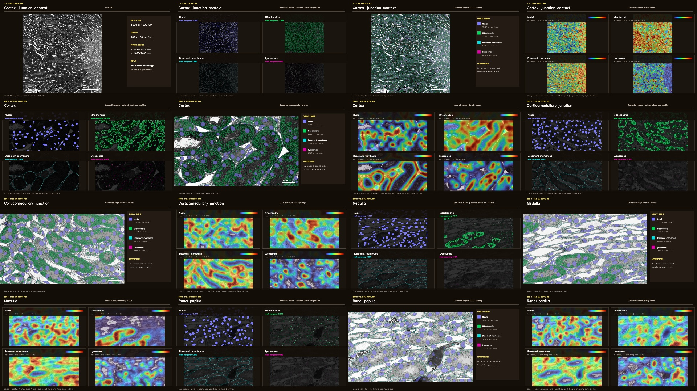

# Kidney CloudVolume mask, overlay, and density video

This example presents a **bounded 1 x 1 mm kidney context ROI**, followed by
four **200 x 112.5 um detail ROIs**. It never reconstructs or displays a
whole-kidney frame.

## What the video shows

[▶ Watch or download the verified 41-second, 1080p video](kidney-local-fields-tour.mp4)

Each ROI follows the same auditable sequence:

1. raw electron microscopy;
2. separate semantic masks for nuclei, mitochondria, basement membrane, and
   lysosomes;
3. a combined transparent overlay on the raw EM;
4. local structure-density maps.

The 1 x 1 mm context is sampled at 160 nm/px. The cortex,
corticomedullary-junction, medulla, and renal-papilla detail fields are sampled
at 80 nm/px. Scale bars and physical bounds are taken from the export manifest.



## Density contract

Density is calculated as positive structure pixels divided by valid tissue
pixels (`0 < raw intensity < 250`) within physical bins. Display heatmaps use a
Gaussian sigma of 0.8 bins. They describe prediction occupancy, not biological
concentration or segmentation accuracy.

## Reproduce from CloudVolume data

Export only the bounded ROIs:

```bash
python export_kidney_story_assets.py \
  --source-root /path/to/precomputed/root \
  --output kidney_local_story_assets.npz
```

Then render and verify the MP4:

```bash
python make_local_tour.py \
  --assets kidney_local_story_assets.npz \
  --force
```

The export records dataset metadata hashes, mip resolutions, physical bounds,
mask value samples, density denominators, and per-layer occupancy in the
generated manifest. The renderer produces a storyboard, the MP4, 16 decoded
keyframe samples, and a machine-readable verification report.

## Verified artifact

- video: `1920 x 1080`, 24 fps, 992 frames, 41.33 seconds;
- scope: one 1 x 1 mm context ROI plus four 200 x 112.5 um detail ROIs;
- layers: nuclei, mitochondria, basement membrane, lysosomes;
- SHA-256: `d12f4e13b6ef20ea994f16065a894b73093a2c6b1490011570c0097fa366c193`;
- all 16 selected raw/mask/overlay/density keyframes decoded successfully.

See [`kidney-local-fields-tour.verification.json`](kidney-local-fields-tour.verification.json)
for the checks and complete timeline. The storyboard is retained at
[`kidney-local-fields-tour-storyboard.jpg`](kidney-local-fields-tour-storyboard.jpg).

The source is a single-section kidney WSI, so it is not evidence for true 3D
mesh reconstruction. Mesh retrieval, bounded label-to-mesh conversion, PLY
export, headless turntable rendering, and distributed video decoding are tested
separately with a real 3D label fixture in the Skill test suite.
