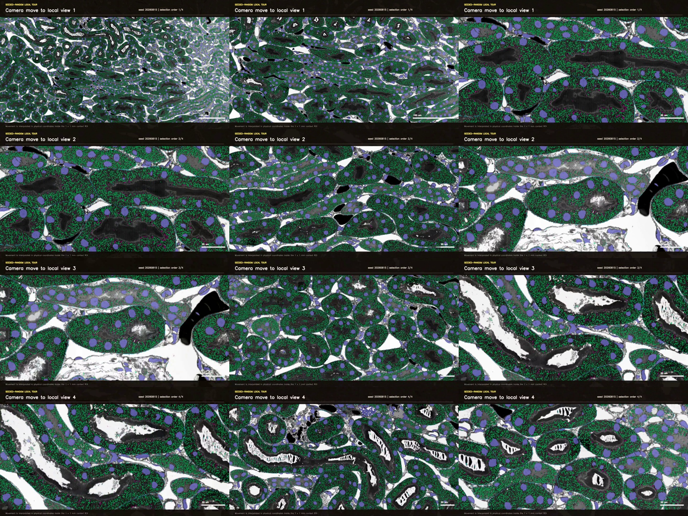

# Kidney CloudVolume context-to-random-local video

This example presents segmentation and density over a **bounded 1 x 1 mm
kidney context ROI**, then visibly moves to four seeded-random **200 x 112.5
um local ROIs** inside that context. It never displays a whole-kidney frame.

## What the video shows

[▶ Watch or download the verified 38-second, 1080p video](kidney-local-fields-tour.mp4)

The auditable sequence is:

1. raw EM over the 1 x 1 mm context;
2. nuclei, mitochondria, basement-membrane, and lysosome masks at the same
   context coordinates;
3. the combined context overlay;
4. nuclei, mitochondria, basement-membrane, and lysosome density maps as four
   separate, full-size context-scale holds;
5. a physical-coordinate camera move to random local view 1 and an overlay
   hold, repeated for views 2–4.

The first camera move changes from a 900 um FOV to 200 um; later moves use a
restrained midpoint zoom-out. Every global result and local overlay hold is
geometrically locked; camera motion occurs only during the four declared move
segments. Raw and masks share one transform, and the physical scale bar follows
the instantaneous FOV.

The context is sampled at 160 nm/px; local fields are sampled at 80 nm/px.
Selection uses seed `20260815`, valid-tissue fraction at least `0.70`, and at
least `220 um` between centers. Stops retain neutral names—no anatomical
identity is inferred.


The motion QA sheet samples the start, midpoint, and end of all four moves:



## Density contract

Density is calculated as positive structure pixels divided by valid tissue
pixels (`0 < raw intensity < 250`) within physical bins. Display heatmaps use a
Gaussian sigma of 0.8 bins. They describe prediction occupancy, not biological
concentration or segmentation accuracy.

## Reproduce from CloudVolume data

Export only the bounded ROIs:

```bash
python export_kidney_story_assets.py \
  --source-root /path/to/precomputed/root \
  --output kidney_random_story_assets.npz \
  --seed 20260815 \
  --random-count 4
```

Then render and verify the MP4:

```bash
python make_local_tour.py \
  --assets kidney_random_story_assets.npz \
  --force
```

The export records dataset metadata hashes, mip resolutions, physical bounds,
mask value samples, density denominators, and per-layer occupancy in the
generated manifest. The renderer produces a storyboard, the MP4, 15 decoded
keyframe samples, and a machine-readable verification report.

## Verified artifact

- video: `1920 x 1080`, 24 fps, 912 frames, 38.0 seconds;
- scope: 1 x 1 mm segmentation/density context plus four seeded-random local views;
- layers: nuclei, mitochondria, basement membrane, lysosomes;
- camera: four visible moves, smoothstep easing, restrained transition zoom-out, zero hold pan/zoom, locked raw-mask transform;
- static-hold QA: phase-correlation displacement at or below `0.15 px` for every global and local hold;
- SHA-256: `ac8c4766bb67f9bb0d3469d54ad3646f19e008dd56ae6593b855816ab33060de`;
- all 15 story keyframes decoded successfully; all verification checks passed.

See [`kidney-local-fields-tour.verification.json`](kidney-local-fields-tour.verification.json)
for the checks and complete timeline. The storyboard is retained at
[`kidney-local-fields-tour-storyboard.jpg`](kidney-local-fields-tour-storyboard.jpg).

The source is a single-section kidney WSI, so it is not evidence for true 3D
mesh reconstruction. Mesh retrieval, bounded label-to-mesh conversion, PLY
export, headless turntable rendering, and distributed video decoding are tested
separately with a real 3D label fixture in the Skill test suite.
