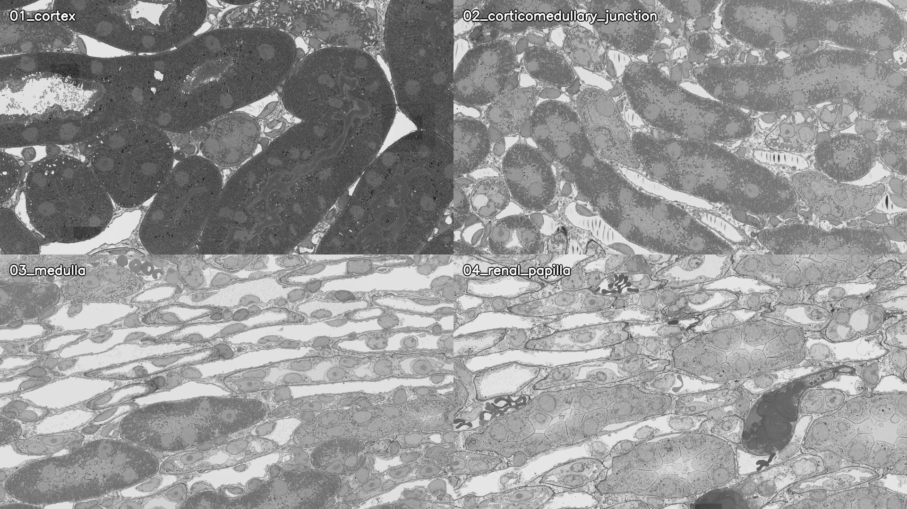

# Kidney local-field CloudVolume example

This example intentionally shows **local kidney fields only**, not a whole-kidney overview.

## Source and view contract

- Source family: kidney EM WSI CloudVolume/precomputed datasets.
- Display sampling: 20 nm/px local review images.
- Regions: cortex, corticomedullary junction, medulla, and renal papilla.
- Related segmentation layers used by the project include nuclei, mitochondria, basement membrane, and lysosome masks.
- Purpose: representative-field visual review and regional structure-density comparison, not segmentation-accuracy benchmarking.

## Local-field video

[▶ Watch or download the 17-second kidney local-field tour](kidney-local-fields-tour.mp4)

- `1920 × 1080`, 24 fps, 408 frames;
- four local fields only, with slow camera motion and a calibrated 2 µm scale bar;
- SHA-256: `58c852086fa0acc0d95f7643797557df46a82abfca50305cb8dba28da10d0bda`;
- all 12 distributed verification samples decoded successfully.

The video is reproducibly assembled from the four exported local-field images by [`make_local_tour.py`](make_local_tour.py). Machine-readable checks are recorded in [`kidney-local-fields-tour.verification.json`](kidney-local-fields-tour.verification.json).

The images demonstrate the local-field presentation policy used by `$cloudvolume-video`. They do not establish biological accuracy without reference annotations.

The kidney WSI source is a single-section presentation source, so it is **not** used as evidence for true 3D mesh reconstruction. Mesh support is separately exercised by automated tests with a real 3D label fixture: bounded ROI extraction, physical-coordinate conversion, PLY export, headless turntable rendering, distributed frame decoding, and hash verification.
